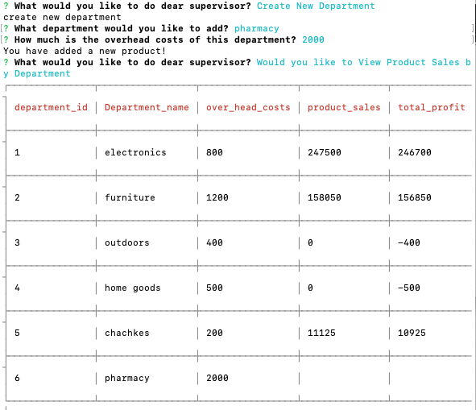

# bamazon Store By Moshe Stern

## About

* This is a command line node app that allows the user to interact with a SQL database that stores the data of the demo store, Bamazon. The the Bamazon store contains three part
* The functionality of the app is split into three parts 
  * **Customer**: able to view all items, takes in orders and tracks inventory
  * **Manager**: able to view low inventory, add to inventroy, and add an item for sale
  * **Supervisor**: view sales by department and create new departments

* Packages Used
    * **dotEnv**: holds your password
    * **inquirer**: allows user interphase
    * **mysql**: comunicates to the database
    * **cli-table3**: shows database data in nice table for user

* Languages/ Database
    * **Javascript**: logic written in
    * **MYSQL**: holds database
    * **Node JS**: communicates to user through command line

## Usage

* `git clone` this repository
* Navigate to directory of the repository
* Run `npm install`
* Run `node bamazonCustomer.js` , `node bamazonManager.js` , `node bamazonSupervisor.js`

## Video Walkthrough
* Video:https://drive.google.com/file/d/1RsOhuo9WziHqhWRLa56mFsIyWQPYFw-N/view

## Screenshots
* MySQL database inital upload 

## bamazonCustomer
* Options
- Buy
- Exit
    ### Buy

 ### Tracking Stock

## bamazonManager
* Options: 
- View Stock
- View low stock
- Add to Inventory
- Add new product
- Exit 
### View Stock

### View Low Stock

### Add to Inventory

### Add New Product: departments based on departments table options

## bamazonSupervisor
* Options
- View Sales by Department
- Create New Department
### View Sales by Department

 ### Create New Department
